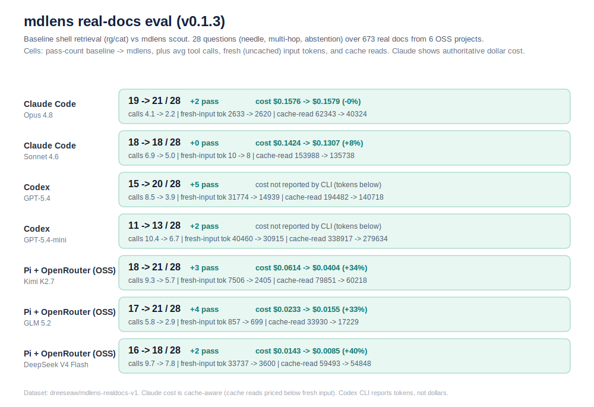

# mdlens

[](https://github.com/Dreeseaw/mdlens/actions/workflows/ci.yml)
[](LICENSE)
[](https://crates.io/crates/mdlens)
[](https://docs.rs/mdlens)

`mdlens` is a Markdown retrieval CLI for AI agents.

The headline command is `mdlens scout`: give it a directory and a natural-language
question, and it returns a bounded evidence pack with likely files, section IDs,
highlights, table/context snippets, and enough structure for one precise follow-up
read.

```bash
mdlens scout docs/ "Which config option controls authentication timeout?" --max-tokens 1400
```

`scout` is meant to replace the common agent pattern of `find`, `rg`, `cat`, and
large raw file reads when the target corpus is Markdown. It works over arbitrary
English Markdown collections: READMEs, runbooks, model cards, generated docs,
experiment logs, tables, stale notes, and multi-file policy docs.

## Agent Integration

For `AGENTS.md`, `CLAUDE.md`, plugin docs, system prompts, or tool routers, add:

```text
When answering questions over Markdown files or documentation directories, consider using `mdlens`.
If `mdlens` is available and you need command guidance, run `mdlens --help` once.
For question answering over a Markdown directory, prefer:
  mdlens scout <dir> "<question>" --max-tokens 1400
Answer from `[highlights]` and `[evidence]` when sufficient.
If exactly one detail is missing, use the section map from `[files]`:
  mdlens read <file> --id <section-id> --max-tokens 1200
Avoid reading whole Markdown files unless scout clearly found the wrong file.
Preserve exact short source terms such as flags, IDs, option names, metrics, table values, and policy phrases.
```

Detailed guidance lives in `mdlens --help` and `mdlens scout --help`, so harness
prompts can stay short while future agents can still discover the workflow.

## Commands

`scout` should be the first call for natural-language QA, multi-file comparison,
stale/current checks, table lookup, and policy/rationale questions.

The other commands are digging tools:

| Command | Use when |
|---|---|
| `read` | `scout` found the right file and one exact section is missing |
| `search` | you need a second independent lexical query |
| `tree` | you only need Markdown structure and section IDs |
| `pack` | you intentionally want selected sections under a hard token budget |
| `sections` | you already have `rg -nH` hits and want section-aware excerpts |
| `stats` | you need file-level size/token estimates |

Examples:

```bash
mdlens read docs/guide.md --id 1.2 --max-tokens 1200
mdlens search docs/ "rate limit"
mdlens tree docs/
rg -nH "rate limit" docs/ | mdlens sections --preview 3 --max-sections 8
```

All commands support `--json` for machine-readable output.
For `scout`, JSON includes `schema_version`, query expansions, selected
candidates, and the same rendered evidence pack in `rendered_text`.

## Evals

Important caveat: this eval is entirely Markdown QA/search. It is not a claim
about broad coding-agent performance, even though Markdown QA is a common part
of coding-agent work. It measures whether agents answer from documentation with
fewer irrelevant reads, fewer calls, lower cost, and better recall.



Public eval notes and locked question sets live in [`evals/`](evals/). Corpora
and raw model outputs are omitted from the public repo; the questions and
methodology are included so readers can inspect the task shapes.

The final combined eval used 30 hard questions over 1,783 Markdown files from
three corpora: messy generated/scene Markdown, a SciCat-style scientific README
proxy, and codebase docs. Five questions are workflow-like cross-corpus analysis
tasks, but none require code edits.

Reproducibility dataset:
[`dreeseaw/mdlens-combined-markdown-v1`](https://huggingface.co/datasets/dreeseaw/mdlens-combined-markdown-v1).

Across the 15 harness/model pairs where both arms completed all rows:

| metric | baseline shell retrieval | mdlens scout workflow |
|---|---:|---:|
| average success | 19.7/30 | 22.7/30 |
| average tool calls | 7.5 | 2.6 |
| average reported cost, priced pairs | $2.41 | $0.93 |

Selected full runs:

| harness/model | baseline | mdlens | cost |
|---|---:|---:|---:|
| Codex + GPT-5.4 | 17/30 | 24/30 | n/a |
| opencode + GPT-5.4 | 18/30 | 24/30 | $3.08 -> $0.97 |
| Pi + GPT-5.4 | 21/30 | 25/30 | $3.64 -> $1.51 |
| opencode + Sonnet 4.6 | 20/30 | 24/30 | $2.54 -> $1.46 |
| Pi + Sonnet 4.6 | 20/30 | 24/30 | $3.51 -> $2.23 |
| Pi + GLM 5.1 | 23/30 | 26/30 | $1.98 -> $0.85 |
| opencode + Kimi K2.6 | 18/30 | 20/30 | $5.19 -> $0.81 |
| opencode + Qwen 3.6 Plus | 22/30 | 24/30 | $0.45 -> $0.24 |

Native Claude rows are documented in the local reports, but the Sonnet run hit
provider/credit `exit_1` failures late in the run and is treated as partial
harness data rather than a clean model comparison.

Other eval families:

- `messy_markdown_v1`: 500 carefully curated synthetic Markdown files with
  malformed formatting, stale/current contradictions, copied distractors,
  multi-needle tables, and cross-file policy/rationale questions.
- `scicat_markdown_v1`: a SciCat-style scientific README proxy, with Hugging
  Face and GitHub scientific Markdown fallback material.
- `codebase_markdown_v1`: repository-doc navigation over real project docs,
  runbooks, design notes, and experiment reports.

The planned next step, if the project gets traction, is a small mock-workflow
eval where each task combines Markdown analysis, a code edit, and JSON/data
inspection in a fresh branch.

## Installation

Requires Rust 1.70+.

```bash
cargo install mdlens
```

Or from source:

```bash
cargo install --git https://github.com/Dreeseaw/mdlens
```

## Claude Code Plugin

`mdlens` also ships as a Claude Code plugin:

```text
/plugin install mdlens
```

## License

MIT. See [LICENSE](LICENSE).
